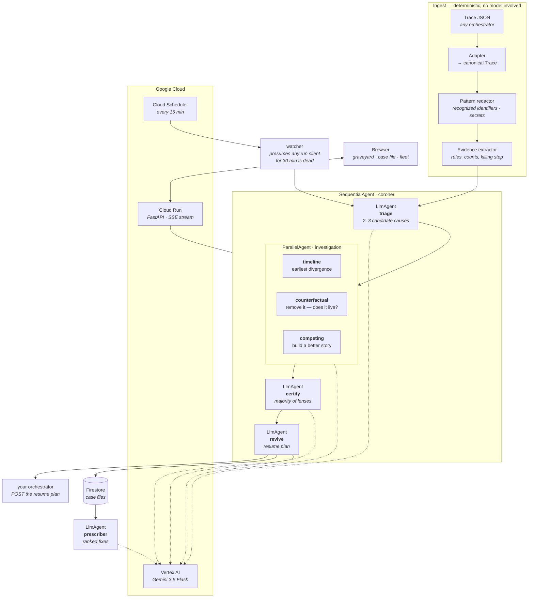

# Coroner

**Your agents don't crash. They ghost you.**

Live: **https://coroner-295057934762.us-central1.run.app**

A multi-agent run that fails loudly is easy. You get a stack trace, you fix it. The expensive ones
simply stop: the board still looks alive, no failure is recorded, and three days later somebody
notices nothing has moved.

Coroner handles that failure in the background. Every fifteen minutes Cloud Scheduler calls a
sweep. A stale run is picked up, six specialized agents examine its trace, a case file is persisted
to Firestore, and the restart plan is delivered to a second service that queues it. Nobody has to
notice the run or press a button first. The written plan is the last artifact in that operational
chain, not the whole product.

## Hackathon category

**The Taskmaster.** The first draft named The Fortified Enterprise Fleet. That category's defining
outcomes include agent registry/discovery, authenticated agent identity, durable multi-week context,
compliance and data-sovereignty controls, and OpenTelemetry auditability; Coroner does not implement
those outcomes. Its demonstrated work is instead a scheduled, asynchronous, multi-step operational
workflow, which is the Taskmaster fit. The rule text and decision record are in
[`docs/RULES-FINDINGS.md`](docs/RULES-FINDINGS.md).

---

## The problem, measured

The source corpus contains **39 real runs from the author's own production orchestrator, used with
the owner's permission**. Those private traces are not published. The repository ships a fictional
structural twin, and the live site shows 39 case files generated from that twin.

`python -m app.metrics` measures those published case files as follows:

| | |
|---|---|
| **36 of 39 (92%)** | classified as silent: still non-terminal, with zero recorded worker failures |
| **19.34%** | mean share of planned steps banked before the stop, over the 33 runs that did not stop on purpose (the 6 `USER_ABORT` cases are excluded) |
| **147 / 73 / 74** | steps planned / banked / abandoned |
| **8 of 39** | cases where the model-certified cause differs from the deterministic regex prior |

That last row is a measured disagreement, not an independent ground-truth label. It does not prove
that the model is right in all eight cases. It shows where the model-backed certificate challenged
the rule-based first guess.

One published case makes the distinction concrete. Its stop text says `"The agent's interactive CLI
was stopped"`, so the regex prior is `WORKER_TERMINATED`. The case file's model certificate instead
selects `STALLED_ON_USER` after considering the earlier unanswered questions. Coroner preserves both
values so the disagreement can be inspected rather than presented as settled fact.

---

## What it does

**One run → a case file.**

- **Cause of death**, in plain English, from eight specific cause labels plus `UNDETERMINED`.
- **The killing step** — which step was in flight, what it was told to do, what it reported.
- **What it cost** — how much of the planned work was thrown away.
- **The prevention** — one concrete change to the orchestrator, specific enough to be a ticket.
- **A revival kit** — where to restart, which steps not to redo, and the exact prompt to
  hand back to the orchestrator.

**Nobody has to ask.** A Cloud Scheduler job hits `/api/sweep` every fifteen minutes; any run still
in a non-terminal state that has not moved for thirty minutes is presumed dead and autopsied
unprompted. `app/watch.py` contains that watcher.

**And it hands the restart back.** Set `CORONER_RESUME_WEBHOOK` and Coroner POSTs the resume plan
to your orchestrator instead of putting a copy button next to it. The watcher does this
automatically, so a run can die, be noticed, be autopsied, and be queued for restart with no human
in the loop at any point. An authenticated stand-in receiver ships in `stub_orchestrator.py` and is
deployed alongside the demo at
**https://coroner-orchestrator-295057934762.us-central1.run.app**. The demo video shows the queued
restart on that second service without publishing its credential.

If delivery fails it says so. A restart you believe happened and did not is worse than none.

**A whole graveyard → a ranked list of fixes.** Every certificate proposes a prevention for
its own run. Most are the same handful of fixes in different words. The fleet pass
collapses related proposals and ranks the validated groups by case count:

> The prescriber grouped **12 zombie-recovery cases** under one proposed recovery-manager change.

Python validates the returned run IDs, removes unknown and duplicate IDs, counts each group, and
sorts it. The grouping and proposed causal remedy are model output; the count is deterministic, and
no counterfactual experiment proves that the change would have saved all 12 runs.

---

## Architecture



### Why it is shaped like this

**The evidence layer never calls a model.** Statuses, retry counts, dependency graphs, which step
was in flight, and how much work was banked are computed in Python. The agents receive those
deterministic observations and are told not to recompute them. Model judgment begins after the
evidence extraction boundary.

**The middle stage is adversarial, and diverse.** The failure mode of an LLM reading a
broken run is to agree with the first plausible story. The three investigators therefore have
different jobs: one attacks the timeline, one attacks cause and effect, and one tries to build a
better story. A hypothesis has to survive a majority of them.

On the published corpus, triage proposed **93 hypotheses** and a majority of lenses killed
**53 (57%)**. A hypothesis is *non-unanimous* when its three Boolean survival verdicts are not all
the same: **13 of 93 (14.0%)** met that definition. Across the three lens-pairs per hypothesis,
**26 of 279 comparisons (9.3%)** disagreed; **9 of 39 cases** contained at least one non-unanimous
hypothesis. The definitions, validation, and counts live in `app/metrics.py`.

The private case set is measured separately rather than mixed into that denominator: 96 hypotheses
proposed, 54 majority-killed (56%), 8 non-unanimous (8.3%), 16 of 288 pairwise disagreements, and
5 of 39 cases with at least one split.

**Rules first, then a jury.** A regex pass over the stop reason gives a prior. The agents
are shown that prior and explicitly told it is fooled whenever the recorded reason
describes the symptom. In **8 of 39** published cases, the certified cause differs from that prior.
That is model-vs-rule disagreement, not proof that either side is independently correct.

---

## Public limits and judge access

An autopsy runs six model-backed agent stages on a private individual's billing account. Public
traffic is therefore bounded:

- `app/limits.py` allows five autopsies per caller per hour and 60 per process instance per hour.
  The buckets live only in memory and reset on cold starts. They are not a service-wide quota.
- Sweep traffic has separate in-memory buckets: eight per caller and 12 per process instance per
  hour. The deployed Cloud Run service allows up to three instances.
- Refusals return `429` with `Retry-After`.
- **Nothing a visitor posts is stored.** `/api/autopsy` and `/api/autopsy/stream` hand the report
  back and forget it. It never enters the shared graveyard, so pointing the live demo at your own
  trace does not publish it to the next person who visits.

Judges receive a separate key in the Devpost testing instructions. Send it as the
`X-Coroner-Judge-Key` request header; a correctly configured key bypasses the public rate gate.
The key value is never committed to this repository or written into these instructions.

## Privacy: exact boundary

The private source corpus stays private; the repository contains its fictional structural twin.
For a trace submitted to either autopsy endpoint, `app/redact.py` pattern-masks these recognized
forms before the first Vertex AI call:

- POSIX, Windows drive-letter, and UNC paths;
- HTTP(S) URLs and domain/path URLs without a scheme;
- email addresses and IPv4 addresses;
- JWTs, PEM private-key blocks, database connection strings, AWS access-key IDs and labelled AWS
  secret keys, bearer tokens, common prefixed tokens, and long hexadecimal keys.

The placeholders are typed and stable, so repeated values remain linkable. This is syntax-based
masking, not anonymization. **Ordinary prose is sent to Vertex AI unchanged**, including personal
names, company names, business facts, phone numbers, and unrecognized secret formats. Remove that
material before uploading a trace. Redaction is on by default and can be disabled with
`CORONER_REDACT=0`.

The public twin is also narrower than “the same file with names changed.” `test_corpus.py` checks
the deterministic rule prior, per-run progress, step statuses, dependency graph, and retry counts
against the source traces. `test_published.py` rejects five banned strings and any verbatim six-word
phrase shared with private free-text fields; it prints the current phrase count instead of freezing
that moving number in documentation. Stop reasons and prose may be rewritten, and model-generated
certificates can differ between the two corpora.

---

## Run it yourself

Prerequisites: a Google Cloud project with billing, and `gcloud`.

```bash
git clone <this repo> && cd coroner
python3 -m venv .venv && ./.venv/bin/pip install -r requirements.txt

# 1. Authenticate. The second command is a separate consent from the first.
gcloud auth login
gcloud auth application-default login
gcloud config set project YOUR_PROJECT
gcloud auth application-default set-quota-project YOUR_PROJECT

# 2. Turn on what it needs.
gcloud services enable aiplatform.googleapis.com run.googleapis.com firestore.googleapis.com
gcloud firestore databases create --database=coroner --location=nam5 --type=firestore-native

# 3. Point it at your project. Gemini 3.5 lives in `global`, not a region.
cat > .env <<ENV
GOOGLE_CLOUD_PROJECT=YOUR_PROJECT
GOOGLE_CLOUD_LOCATION=global
GOOGLE_GENAI_USE_VERTEXAI=true
ENV

# 4. Prove the taxonomy still holds against the corpus (no model calls, instant).
./.venv/bin/python test_corpus.py
./.venv/bin/python -m app.redact          # redactor self-check

# 5. Autopsy one run, then the whole graveyard.
./.venv/bin/python cli.py case data/sample-trace.json
./.venv/bin/python cli.py autopsy-all data/demo-traces    # ~3 min, writes data/cases/
./.venv/bin/python cli.py fleet > data/fleet.json

# 6. Serve it.
./.venv/bin/uvicorn server:api --port 8080
#    → http://127.0.0.1:8080
```

Deploy:

```bash
CORONER_STORE=firestore ./.venv/bin/python cli.py seed        # push case files to Firestore
gcloud run deploy coroner --source . --region us-central1 --allow-unauthenticated \
  --max-instances 3 \
  --set-env-vars "GOOGLE_CLOUD_PROJECT=YOUR_PROJECT,GOOGLE_CLOUD_LOCATION=global,\
GOOGLE_GENAI_USE_VERTEXAI=true,CORONER_STORE=firestore,CORONER_MODEL=gemini-3.5-flash"

# Let it watch. Without this, Coroner only autopsies what you hand it.
./.venv/bin/python cli.py seed-traces                          # give the watcher something to watch
gcloud services enable cloudscheduler.googleapis.com
gcloud scheduler jobs create http coroner-sweep --location=us-central1 \
  --schedule="*/15 * * * *" --http-method=POST --attempt-deadline=900s \
  --uri="https://YOUR-SERVICE-URL/api/sweep"
```

---

## Bring your own orchestrator

`app/traces.py` is the seam. Everything above it is vendor-specific; everything below it
is not. To support another orchestrator, write one function that maps its dump onto
`Trace`, and register it:

```python
def from_yours(raw: dict, run_id: str = "") -> Trace: ...
ADAPTERS["yours"] = from_yours
```

The taxonomy in `app/findings.py` is a table of nine causes with the regexes that match
them. Add a row when your orchestrator dies in a way the table doesn't cover — the test
fails if more than 15% of a corpus lands in `UNDETERMINED`.

---

## Stack

| Requirement | Used |
|---|---|
| Gemini 3.5 or newer | `gemini-3.5-flash` on Vertex AI |
| Google Agent Framework | **Google ADK 2.7** — `SequentialAgent`, `ParallelAgent`, `LlmAgent`, `Runner`, typed `output_schema` |
| Google Cloud infrastructure | **Cloud Run** (service), **Firestore** (case files, native mode), **Cloud Scheduler** (the watcher) |

No frontend framework and no build step — the UI is three files served straight from the
container.

## Checks

All eight checks were run offline: they make no network request and no model call. Six run from a
clone with the installed dependencies. The full `test_published.py` and `python -m app.metrics`
commands also require maintainer-local corpus directories; they never fetch those private inputs.

```
python test_inputs.py      # malformed inputs, bounded bodies, prompt boundary, UI/handoff regressions
python test_corpus.py      # taxonomy coverage; checked twin fields match the source traces
python test_published.py   # banned strings and verbatim six-word overlap; prints the live phrase count
python -m app.metrics      # validates metric definitions, then measures configured case directories
python -m app.redact       # every documented pattern class; stable placeholders
python -m app.watch        # stale runs swept; fresh and terminal runs ignored
python -m app.limits       # per-caller and per-instance buckets refuse and refill
python -m app.resume       # authenticated delivery and explicit failure results
```

The checked published metric output is: 39 cases; 93 hypotheses proposed; 53 killed by a majority;
13 non-unanimous; 26 of 279 pairwise disagreements; 9 cases with at least one split; 8 certificate/
prior disagreements; 36 silent stops; 19.3375% mean progress over the 33 runs that did not stop on purpose; and 147/73/74 steps
planned/banked/abandoned.
