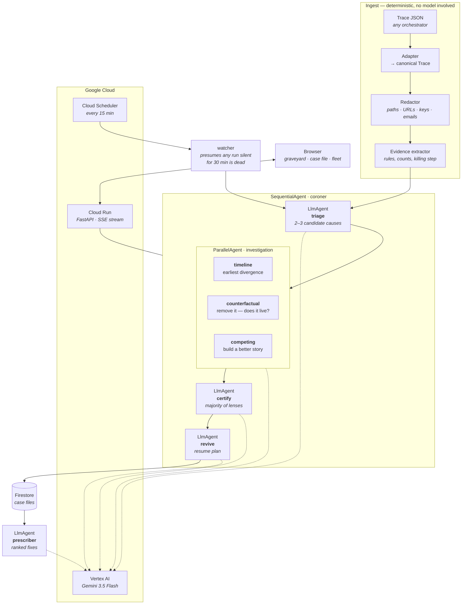

# Coroner

**Your agents don't crash. They ghost you.**

Live: **https://coroner-295057934762.us-central1.run.app**

A multi-agent run that fails loudly is easy. You get a stack trace, you fix it. The
expensive ones are the runs that simply stop — the board still looks alive, no error was
ever raised, and three days later somebody notices nothing has moved.

Coroner is the post-mortem service for those runs. You give it the trace a dead run left
behind. Six agents examine it, argue about it, and hand back a death certificate and a
plan to restart the run from where it fell over.

---

## The problem, measured

Coroner was designed against **39 real dead runs** from a production multi-agent
orchestrator — not a hypothetical. Reading them:

| | |
|---|---|
| **92%** | stopped without ever reporting a failure. They didn't crash. They went quiet. |
| **18%** | of planned work was banked before death, on average |
| **74 of 147** | planned steps abandoned across the fleet |
| **8 of 39** | runs where the recorded stop reason was **wrong**, and the agents caught it |

The published twin reproduces every one of those figures independently — same 36/39 silent, same
74 abandoned steps, same 8 of 39 overruled — which is the point of building it the way it is built.

That last row is the whole product. A trace saying `"The agent's interactive CLI was
stopped"` is a string-matcher's dream and a liar: the CLI closing was the *consequence* of
a run that had been sitting on an unanswered question for hours. Rules believe the string.
Coroner doesn't.

---

## What it does

**One run → a case file.**

- **Cause of death**, in plain English, from a fixed taxonomy of nine causes read off the
  real corpus rather than invented.
- **The killing step** — which step was in flight, what it was told to do, what it reported.
- **What it cost** — how much of the planned work was thrown away.
- **The prevention** — one concrete change to the orchestrator, specific enough to be a ticket.
- **A revival kit** — where to restart, which steps not to redo, and the exact prompt to
  hand back to the orchestrator.

**Nobody has to ask.** 92% of these runs never announced they had died, so a post-mortem service you
have to *invoke* solves half the problem. A Cloud Scheduler job hits `/api/sweep` every fifteen
minutes; any run still in a non-terminal state that has not moved for thirty minutes is presumed
dead and autopsied unprompted. `app/watch.py` is the whole of it.

**A whole graveyard → a ranked list of fixes.** Every certificate proposes a prevention for
its own run. Most are the same handful of fixes in different words. The fleet pass
collapses them and ranks by deaths prevented:

> **12 of 39 runs** would have been saved by one change to the recovery manager.

---

## Architecture



### Why it is shaped like this

**The evidence layer never calls a model.** Statuses, retry counts, dependency graphs,
which step was in flight, how much work was banked — all counted in Python. The agents
receive those numbers and are told not to recompute them. A model that is allowed to count
will eventually count wrong, and a post-mortem that gets its own arithmetic wrong is worse
than none.

**The middle stage is adversarial, and diverse.** The failure mode of an LLM reading a
broken run is to agree with the first plausible story. Three identical skeptics agree with
each other too. So the three investigators are given genuinely different jobs — one attacks
the timeline, one attacks cause and effect, one tries to build a better story — and a
hypothesis has to survive a majority of them.

Measured over the corpus: **56% of proposed hypotheses were killed**, and the three lenses
**disagreed with each other on 60%** of hypotheses. The adversarial stage is doing work,
not rubber-stamping.

**Rules first, then a jury.** A regex pass over the stop reason gives a prior. The agents
are shown that prior and explicitly told it is fooled whenever the recorded reason
describes the symptom. On 8 of 39 runs they overruled it.

---

## Running somebody else's money

The hosted demo is open to the internet and every autopsy is six live model calls, so the endpoints
that spend money are bounded rather than trusting:

- **`app/limits.py`** — a token bucket per caller and a second one for the whole service. Five
  autopsies per caller per hour, sixty across the service; sweeps are tighter. Refusals return
  `429` with `Retry-After` instead of quietly billing.
- **Cloud Run `--max-instances 3`**, and a billing budget with alerts at 50 / 90 / 100%.
- **Nothing a visitor posts is stored.** `/api/autopsy` streams the report back and forgets it. It
  never enters the shared graveyard, so pointing the live demo at your own trace does not publish it
  to the next person who visits.

## Privacy: how a private corpus ships a public demo

The 39 traces are real runs, full of somebody's actual work — file paths, internal
hostnames, whatever the human asked for. Two separate mechanisms:

1. **Redaction at ingest** (`app/redact.py`). Paths, URLs, keys, emails and IPs are replaced
   with stable typed placeholders — `<path:38f93f>` — before the first model call. Stable,
   so a model can still see that two steps touched the same file without seeing which file.
   On by default; `CORONER_REDACT=0` to disable.

2. **A structural twin** (`tools/synthesize.py`) for the published corpus. Every structural
   field is copied byte-for-byte — statuses, dependency graph, retry counts, stop reasons,
   completed-step ledger — and only the project content is regenerated as an unrelated
   fictional project. `test_corpus.py` asserts the twin still produces an identical cause
   distribution and identical per-run progress. The demo corpus in `data/demo-traces/` is
   not a mock-up; it is the same corpus with the names changed.

---

## Run it yourself

Prerequisites: a Google Cloud project with billing, and `gcloud`.

```bash
git clone <this repo> && cd coroner
python3 -m venv .venv && ./.venv/bin/pip install -r requirements.txt

# 1. Authenticate. The second command is a separate consent from the first.
gcloud auth login
gcloud auth application-default login
gcloud config set project YOUR_PROJECT
gcloud auth application-default set-quota-project YOUR_PROJECT

# 2. Turn on what it needs.
gcloud services enable aiplatform.googleapis.com run.googleapis.com firestore.googleapis.com
gcloud firestore databases create --database=coroner --location=nam5 --type=firestore-native

# 3. Point it at your project. Gemini 3.5 lives in `global`, not a region.
cat > .env <<ENV
GOOGLE_CLOUD_PROJECT=YOUR_PROJECT
GOOGLE_CLOUD_LOCATION=global
GOOGLE_GENAI_USE_VERTEXAI=true
ENV

# 4. Prove the taxonomy still holds against the corpus (no model calls, instant).
./.venv/bin/python test_corpus.py
./.venv/bin/python -m app.redact          # redactor self-check

# 5. Autopsy one run, then the whole graveyard.
./.venv/bin/python cli.py case data/sample-trace.json
./.venv/bin/python cli.py autopsy-all data/demo-traces    # ~3 min, writes data/cases/
./.venv/bin/python cli.py fleet > data/fleet.json

# 6. Serve it.
./.venv/bin/uvicorn server:api --port 8080
#    → http://127.0.0.1:8080
```

Deploy:

```bash
CORONER_STORE=firestore ./.venv/bin/python cli.py seed        # push case files to Firestore
gcloud run deploy coroner --source . --region us-central1 --allow-unauthenticated \
  --max-instances 3 \
  --set-env-vars "GOOGLE_CLOUD_PROJECT=YOUR_PROJECT,GOOGLE_CLOUD_LOCATION=global,\
GOOGLE_GENAI_USE_VERTEXAI=true,CORONER_STORE=firestore,CORONER_MODEL=gemini-3.5-flash"

# Let it watch. Without this, Coroner only autopsies what you hand it.
./.venv/bin/python cli.py seed-traces                          # give the watcher something to watch
gcloud services enable cloudscheduler.googleapis.com
gcloud scheduler jobs create http coroner-sweep --location=us-central1 \
  --schedule="*/15 * * * *" --http-method=POST --attempt-deadline=900s \
  --uri="https://YOUR-SERVICE-URL/api/sweep"
```

---

## Bring your own orchestrator

`app/traces.py` is the seam. Everything above it is vendor-specific; everything below it
is not. To support another orchestrator, write one function that maps its dump onto
`Trace`, and register it:

```python
def from_yours(raw: dict, run_id: str = "") -> Trace: ...
ADAPTERS["yours"] = from_yours
```

The taxonomy in `app/findings.py` is a table of nine causes with the regexes that match
them. Add a row when your orchestrator dies in a way the table doesn't cover — the test
fails if more than 15% of a corpus lands in `UNDETERMINED`.

---

## Stack

| Requirement | Used |
|---|---|
| Gemini 3.5 or newer | `gemini-3.5-flash` on Vertex AI |
| Google Agent Framework | **Google ADK 2.7** — `SequentialAgent`, `ParallelAgent`, `LlmAgent`, `Runner`, typed `output_schema` |
| Google Cloud infrastructure | **Cloud Run** (service), **Firestore** (case files, native mode), **Cloud Scheduler** (the watcher) |

No frontend framework and no build step — the UI is three files served straight from the
container.

## Checks

Non-trivial logic leaves one runnable check behind:

```
python test_corpus.py     # taxonomy explains ≥85% of the corpus; published twin matches structure
python test_published.py  # no phrase from the private corpus survives into the published one
python -m app.redact      # nothing leaks; placeholders stable across calls
python -m app.watch       # stale runs are swept; fresh and finished ones are left alone
python -m app.limits      # the spend ceilings actually hold, and refill
```

All five run without a network or a model.
