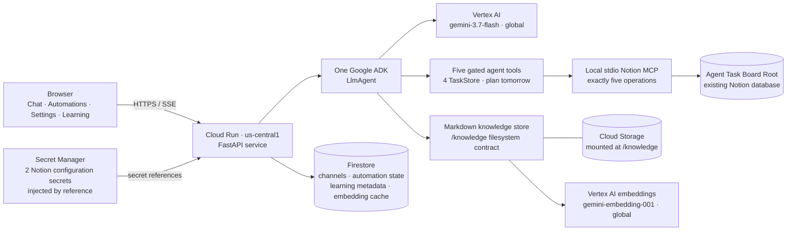

# Architecture

This is the deployed release topology for Avi's Notes Assistant. The public
Cloud Run service runs in `us-central1`; its Vertex AI model and embedding
requests use the `global` location.

The deployed model-backed request path is:

`browser -> Cloud Run/FastAPI -> one Google ADK LlmAgent -> Vertex gemini-3.7-flash (global) -> twelve gated tools -> TaskStore/Notion MCP -> the configured database`.

The model uses its language understanding to distinguish tasks, ordinary chat,
and tomorrow planning; there is no regex pre-router. Its tools are create,
rename, change fields/Status, list, and plan tomorrow. The planning tool accepts
an optional Place, canonicalizes it against recent board values plus `Anywhere`,
and returns the existing deterministic two-plan sweep. The adapter beneath the
four TaskStore tools still compiles to exactly five MCP operations:
`create_page`, `set_page_title`, `set_page_property`, `query_database`, and
`archive_page`. The agent has no raw MCP access and no archive tool.

One channel-scoped gate wraps that complete five-tool list. It permits ordinary
task channels, refuses all five tools in automation channels, and fails closed
when channel identity is unavailable. Refusals are tool results the same model
can read and route around; no second agent or Runner exists.

Cloud Run receives two Notion configuration secrets from Secret Manager through
secret references, never as literal environment values. Access is limited to the
compute runtime identity with `roles/secretmanager.secretAccessor`.

Firestore runs in Native mode and stores durable browser channels, the two stable
automation records, aggregate source metadata, and embedding-cache metadata.
Markdown bodies use the `/knowledge` filesystem contract; the deployed Cloud Run
service mounts a dedicated Cloud Storage volume there. This document reflects the
live release topology.
