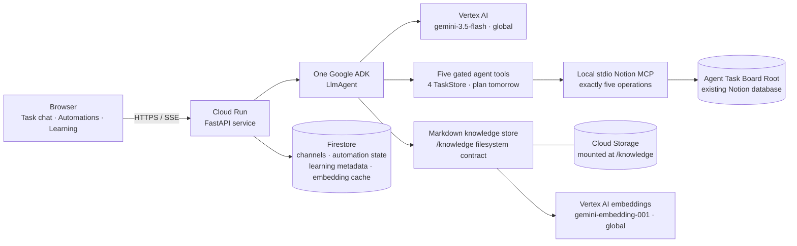

# Architecture

This is the intended release topology. It is configuration documentation, not
evidence that anything has been deployed.

The one model-backed request path is:

`browser -> Cloud Run/FastAPI -> one Google ADK LlmAgent -> Vertex gemini-3.5-flash (global) -> five gated tools -> TaskStore/Notion MCP -> the configured database`.

The model uses its language understanding to distinguish tasks, ordinary chat,
and tomorrow planning; there is no regex pre-router. Its tools are create,
rename, change fields/Status, list, and plan tomorrow. The planning tool accepts
an optional Place, canonicalizes it against recent board values plus `Anywhere`,
and returns the existing deterministic two-plan sweep. The adapter beneath the
four TaskStore tools still compiles to exactly five MCP operations:
`create_page`, `set_page_title`, `set_page_property`, `query_database`, and
`archive_page`. The agent has no raw MCP access and no archive tool.

One channel-scoped gate wraps that complete five-tool list. It permits ordinary
task channels, refuses all five tools in automation channels, and fails closed
when channel identity is unavailable. Refusals are tool results the same model
can read and route around; no second agent or Runner exists.

Firestore stores durable browser channels, the two stable automation records,
aggregate source metadata, and embedding-cache metadata. Markdown bodies use the
`/knowledge` filesystem contract; an approved Cloud Run deployment would mount a
dedicated Cloud Storage volume there. No deployment or cloud-resource mutation is
part of this release candidate.
