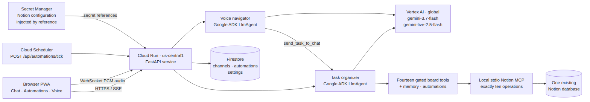
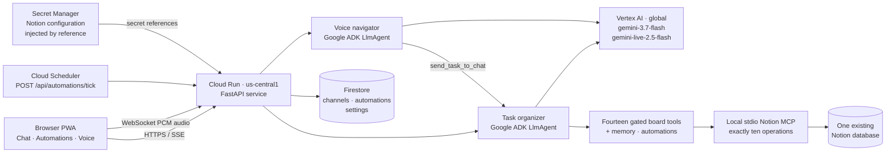

# Architecture

This is the deployed release topology for Agentonomy Tasks. The public
Cloud Run service runs in `us-central1`; its Vertex AI model and embedding
requests use the `global` location.

The deployed chat request path is:

`browser -> Cloud Run/FastAPI -> one Google ADK LlmAgent -> Vertex gemini-3.7-flash (global) -> gated tools -> TaskStore/Notion MCP -> the configured database`.

The model uses its language understanding to distinguish tasks from ordinary
chat; there is no regex pre-router. Its board tools are create, rename, change
fields/Status, list, search, read/write details pages, tick checkboxes,
attach files, set reminders, delete/restore, and comments — fourteen in all — plus `remember` and
`clear_memory` for one word-capped user memory stored in settings, and
`list_automations` and `run_automation`. The adapter beneath them compiles to exactly ten MCP
operations: `create_page`, `set_page_title`, `set_page_property`,
`query_database`, `archive_page`, `restore_page`, `get_page_markdown`,
`update_page_markdown`, `add_page_comment`, and `list_comments`. The agent has
no raw MCP access; deleting archives rather than destroys, so restoring can
undo it.

One channel-scoped gate wraps every one of those tools. Chat and automation
channels get the same access; the gate fails closed when channel identity is
unavailable, and refuses `run_automation` inside an automation channel so no
automation can start another. Refusals are tool results the same model can
read and route around. Files attached to a message are written to the
`/knowledge` volume, served back by the app at unguessable URLs, and embedded
in Notion pages as external-image blocks.

The second agent is the live voice navigator: an ADK `LlmAgent` on
`gemini-live-2.5-flash` speaking over a WebSocket (PCM audio both ways). It can
read the board — list, search, details pages, comments — but never change it:
every change goes through `send_task_to_chat` into the visible chat, where the
task organizer handles it. Its other tools are `navigate` (move the app to a
pane) and `run_automation`.

Cloud Run receives the Notion configuration secrets from Secret Manager through
secret references, never as literal environment values. Access is limited to the
compute runtime identity with `roles/secretmanager.secretAccessor`.

Firestore runs in Native mode and stores durable browser channels, automation
records with their structured triggers, and settings. This document reflects
the live release topology.
