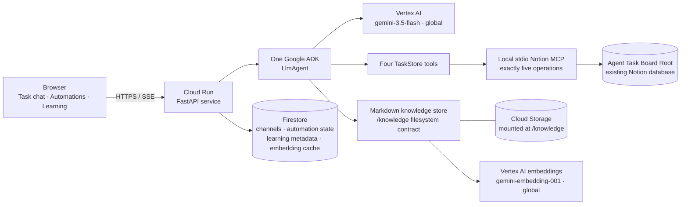

# Architecture

This is the intended release topology. It is configuration documentation, not
evidence that anything has been deployed.

The one model-backed task path is:

`browser → Cloud Run/FastAPI → one Google ADK LlmAgent → Vertex gemini-3.5-flash (global) → four TaskStore tools → Notion MCP → the configured database`.

The four tools available to the agent are create, rename, change fields/Status,
and list. The adapter beneath them compiles to exactly five MCP operations:
`create_page`, `set_page_title`, `set_page_property`, `query_database`, and
`archive_page`. The agent has no raw MCP access and no archive tool.

One channel-scoped gate wraps that complete four-tool list. It permits ordinary
task channels, refuses all four tools in automation channels, and fails closed
when channel identity is unavailable. Refusals are tool results the same model
can read and route around; no second agent or Runner exists.

Firestore stores durable browser channels, the two stable automation records,
aggregate source metadata, and embedding-cache metadata. Markdown bodies use the
`/knowledge` filesystem contract; an approved Cloud Run deployment would mount a
dedicated Cloud Storage volume there. No deployment or cloud-resource mutation is
part of this release candidate.
